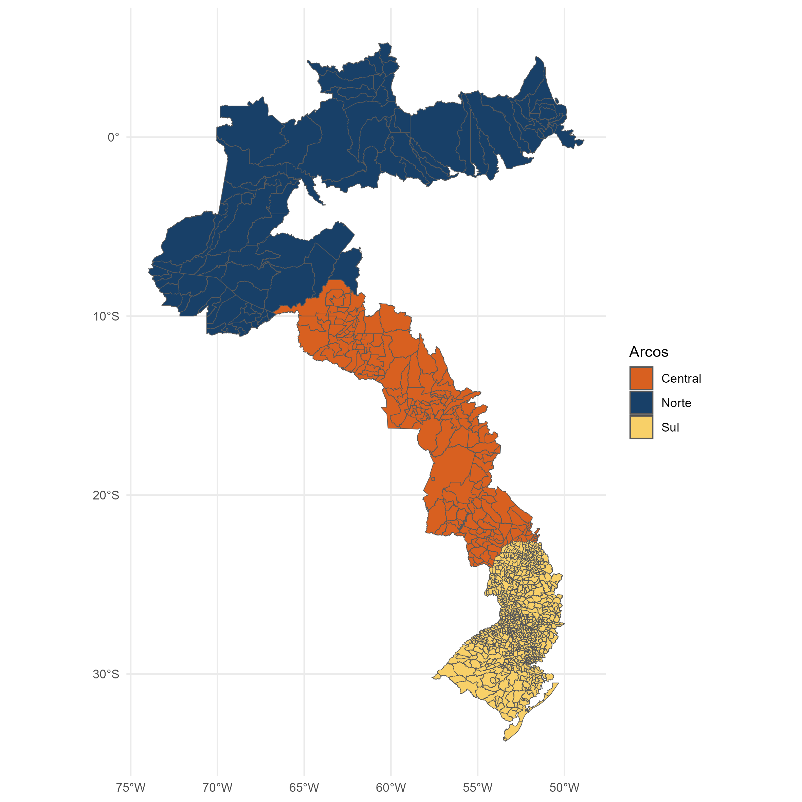
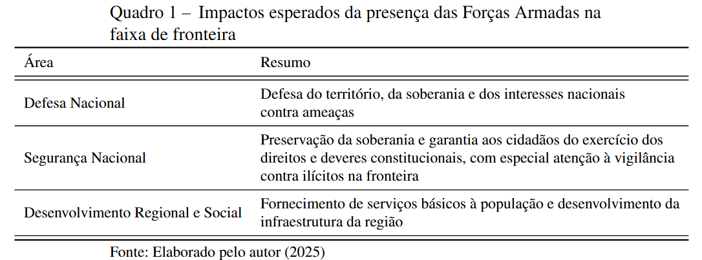

# Introduction


## Definição:


A Faixa de Fronteira ocupa 27% do território Brasileiro

588 municípios, 11 estados, 16.886 km de fronteira

Arcos da Faixa de Fronteira
Arco Norte (AP, PA, RR, AM, AC)
Arco Central (RO, MT, MS)
Arco Sul (PR, SC, RS)

# Arcos



Arco Norte: Expansão do confronto entre facções (PCC e CV) Tráfico de drogas e crimes ambientais (extração de madeira, mineração) Rota de passagem para o crime transnacional Integração à economia local

Arco Central: Avanço da fronteira econômica (principalmente agrícola) Apreensões de drogas e grande corredores por onde passam o tráfico Tráfico formiga

Arco Sul: Desempenho urbano e econômico Maior presença das forças de segurança, Fronteira altamente regulada Alto grau de integração: Aumento do contrabando e do tráfico

# Forças armadas

National Defense: Defense of territory, sovereignty and national interests against threats

National Security: Preservation of sovereignty and guarantee for citizens the exercise of constitutional rights and duties, with special attention to vigilance against illicit activities at the border

Social and Regional Development: Provision of basic services to the population and development of the region’s infrastructure 

# Objetivos

\begin{itemize}
        \item Analisar os efeitos da descontinuidade geográfica gerada pela Faixa de Fronteira sobre as taxas de homicídio;
        \item Investigar heterogeneidades nos efeitos da Faixa de Fronteira sobre a violência, considerando diferenças nos fatores socioeconômicos, arcos e períodos.
        \item Avaliar a robustez dos resultados utilizando diferentes configurações de amostra que isolam efeitos específicos
    \end{itemize}


# Revisão de literatura

# Tratamento e controle

# Conclusão

No Arco Norte, a presença das Forças Armadas na Faixa de Fronteira está
associada a uma redução na taxa de homicídios;

No Arco Central, por outro lado, foi identificado um efeito contrário
(contraintuitivo);

No Arco Sul, não foram encontrados efeitos estatisticamente
significativos;

Conforme apresentado pela literatura, esses efeitos podem estar
relacionados ao tamanho e à intensidade de operações de segurança em
diferentes anos, como a Operação Ágata;

Dentre as classificações alternativas, o efeito sede e efeito forças
armadas apresentaram padrões semelhantes à análise principal

```{r}
###############################
```

# Motivação I

Dinâmica da Violência e do Desenvolvimento Econômico na Faixa de Fronteira
        
A Faixa de Fronteira ocupa 27% do território Brasileiro

588 municípios, 11 estados, 16.886 km de fronteira

Arcos da Faixa de Fronteira
Arco Norte (AP, PA, RR, AM, AC)
Arco Central (RO, MT, MS)
Arco Sul (PR, SC, RS)

# Motivação II


# Motivação III

Arco Norte: Expansão do confronto entre facções (PCC e CV) Tráfico de drogas e crimes ambientais (extração de madeira, mineração) Rota de passagem para o crime transnacional Integração à economia local

Arco Central: Avanço da fronteira econômica (principalmente agrícola) Apreensões de drogas e grande corredores por onde passam o tráfico Tráfico formiga

Arco Sul: Desempenho urbano e econômico Maior presença das forças de segurança, Fronteira altamente regulada Alto grau de integração: Aumento do contrabando e do tráfico

# Motivação IV


# Motivação V
    Forças Armadas e Segurança na Faixa de Fronteira 
    
Políticas de Defesa
Programa Calha Norte (PCN)Sistema de Monitoramento Integrado de Monitoramento de Fronteira (SISFRON)Operação Ágata, Política Nacional de Defesa (PND) e a Estratégia Nacional de Defesa (END)
            
Políticas de SegurançaEstratégia Nacional de Segurança Pública nas Fronteiras (Enafron)Projeto Unidades Especializadas de Fronteiras (Pefron, 2008)Plano Estratégico de Fronteiras (PEF, 2011)Programa de Proteção Integrada de

Objetivos

O objetivo geral deste estudo é avaliar o impacto das políticas aplicadas na Faixa de Fronteira sobre a segurança pública, com especial atenção à atuação das Forças Armadas.
    
Quanto aos objetivos específicos:
      Analisar os efeitos da descontinuidade geográfica gerada pela Faixa de Fronteira sobre as taxas de homicídio;
        Investigar heterogeneidades nos efeitos da Faixa de Fronteira sobre a violência, considerando diferenças nos fatores socioeconômicos, arcos e períodos.
        Avaliar a robustez dos resultados utilizando diferentes configurações de amostra que isolam efeitos específicos
    
# Design de Regressão Descontínua

##Revisão de Literatura I: Design de Regressão Descontínua
    Configuração básica de um modelo RD:
    Thistlethwaite e Campbell: impacto de prêmios de mérito escolar no futuro acadêmico dos estudantes. Prêmios eram atribuídos com base em uma determinada nota: estudantes cuja pontuação $X$ atingisse ou excedesse um valor de corte $c$ eram agraciados, enquanto aqueles com pontuação inferior não eram contemplados. Esse mecanismo gera uma \textit{descontinuidade} no tratamento como função da nota. Seja a recepção do tratamento representada por $D \in {0,1}$, temos então $D=1$ se $X\geq c$ e $D=0$ se $X<c$
    \end{itemize}
    \begin{equation}
        Y = \alpha + D\tau + X\beta + \varepsilon
    \end{equation}

## Revisão de Literatura II}

    
Essa regressão é estimada em uma subamostra dos dados que é estatisticamente otimizada perto do valor do ponto de corte. A razão pela qual todos os dados disponíveis não são utilizados deve-se ao trade-off entre variância e viés
       Três elementos importantes para lidar com RD
            Variável de corte (Running variable)
            Ponto de corte (Cutoff)
            Janela, ou largura de banda (Bandwidth)    

# Revisão de literatura III: Design de Regressão Descontínua Espacial
Uma das principais limitações do RD tradicional em dados espaciais é sua dependência de um ponto de corte unidimensional.Enquanto o RD tradicional utiliza uma variável contínua para definir o cutoff, em contextos espaciais, a fronteira é bidimensional, frequentemente representada por coordenadas geográficas. Isso exige métodos que possam lidar com a natureza multidimensional das fronteiras geográficas.


%% ---------------------------------------------------------------------------
# Metodologia



# Metodologia II 

Definição dos grupos de tratamento e controle
    


\begin{frame}{Metodologia III}
    \centering
    \includegraphics[width=1\linewidth]{images/tabela_grupos.png}
\end{frame}

\begin{frame}{Metodologia IV}
    \centering
    \includegraphics[width=1\linewidth]{images/classificacoes.png}
\end{frame}

\begin{frame}{Base de dados}
     \includegraphics[width=1\linewidth]{images/tabela_descritivas.png}
\end{frame}

\begin{frame}{Modelo RD Espacial I}
\centering
    \includegraphics[width=0.6\linewidth]{images/rdplots.png}
\end{frame}

\begin{frame}{Modelo RD Espacial II}
\begin{columns}
    \column{0.5\textwidth}
    \begin{equation}
        Y = \alpha + \tau D + \beta X + \gamma Z +\varepsilon
    \end{equation}
    
    \column{0.5\textwidth}
    Hipóteses:
    \begin{itemize}
        \item Variável de corte não possa ser manipulada, e, portanto, a participação no tratamento seja exógena \cite{lee_regression_2010}.
        \item Não haja descontinuidade das covariáveis no ponto de corte \cite{lee_regression_2010}.
        \item Dados restritos para o mais próximo possível do ponto de corte onde as unidades são mais comparáveis entre si \cite{calonico_optimal_2020}.
    \end{itemize}
    
\end{columns}

\end{frame}


\begin{frame}{Modelo RD Espacial III}
\centering
    \includegraphics[width=0.6\linewidth]{images/tabela_rd.png}
\end{frame}

% \begin{frame}{Modelo Linear: Classificações alternativas}
% \centering

% \begin{tabular}{c|c}
%      \includegraphics[width=0.383\linewidth]{images/tabela_c2.png} &  
%     \includegraphics[width=0.4\linewidth]{images/tabela_c4.png}\\
%     {\tiny Classificação 2} & {\tiny Classificação 4}
% \end{tabular}
% \end{frame}

%% ---------------------------------------------------------------------------
% This presentation is separated by sections and subsections
\section{Considerações finais}
\begin{frame}{Considerações Finais}

    \begin{itemize}
        \item No Arco Norte, a presença das Forças Armadas na Faixa de Fronteira está associada a uma redução na taxa de homicídios; 
        \item No Arco Central, por outro lado, foi identificado um efeito contrário (contraintuitivo);
        \item No Arco Sul, não foram encontrados efeitos estatisticamente significativos;
        \item Conforme apresentado pela literatura, esses efeitos podem estar relacionados ao tamanho e à intensidade de operações de segurança em diferentes anos, como a Operação Ágata;
        \item Dentre as classificações alternativas, o efeito sede e efeito forças armadas apresentaram padrões semelhantes à análise principal
        
    \end{itemize}
    \vspace{10px}
\end{frame}

%% ---------------------------------------------------------------------------
% Reference frames
\begin{frame}[allowframebreaks]
    \frametitle{Referências}
    \printbibliography
\end{frame}

%% ---------------------------------------------------------------------------
% Final frame
\begin{frame}{}
    \centering
    \huge{\textbf{\example{Obrigado!}}}
    
    \vspace{1cm}
    
    \Large{\textbf{Contato:}}
    \newline
    \vspace*{0.5cm}
    \large{\email{batistajvictor@gmail.com}}
\end{frame}

