# Motivação
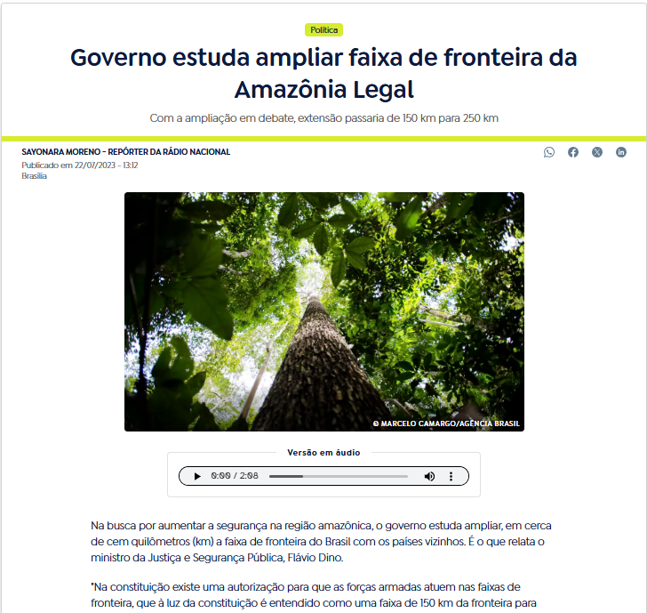{fig-align="center"}

## Definições
- A Faixa de Fronteira ocupa 27% do território Brasileiro

- 588 municípios, 11 estados, 16.886 km de fronteira

- Arcos da Faixa de Fronteira
  - Arco Norte (AP, PA, RR, AM, AC)
  - Arco Central (RO, MT, MS)
  - Arco Sul (PR, SC, RS)

---

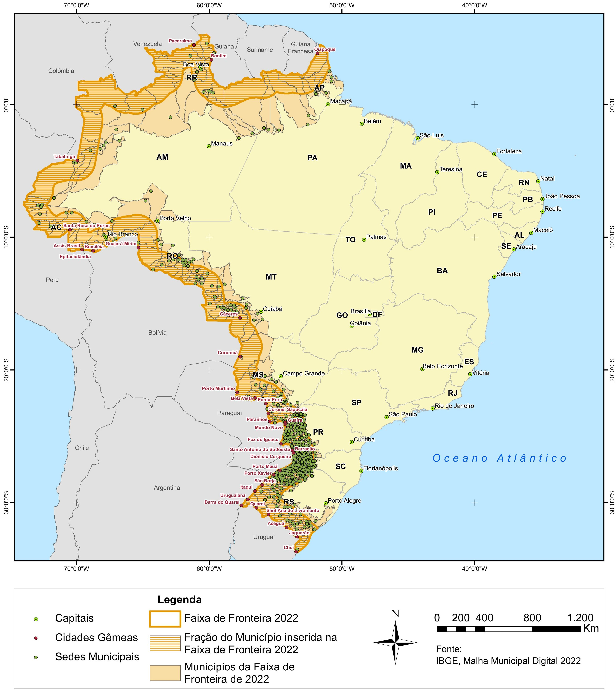{fig-align="center"}

## Arcos

- Arco Norte:
  - Expansão do confronto entre facções (PCC e CV)
  - Tráfico de drogas e crimes ambientais (extração de madeira, mineração)
  - Rota de passagem para o crime transnacional Integração à economia local

- Arco Central:
  - Avanço da fronteira econômica (principalmente agrícola)
  - Apreensões de drogas e grande corredores por onde passam o tráfico
  - Tráfico formiga

- Arco Sul: 
  - Desempenho urbano e econômico
  - Maior presença das forças de segurança, fronteira altamente regulada
  - Alto grau de integração: Aumento do contrabando e do tráfico

---

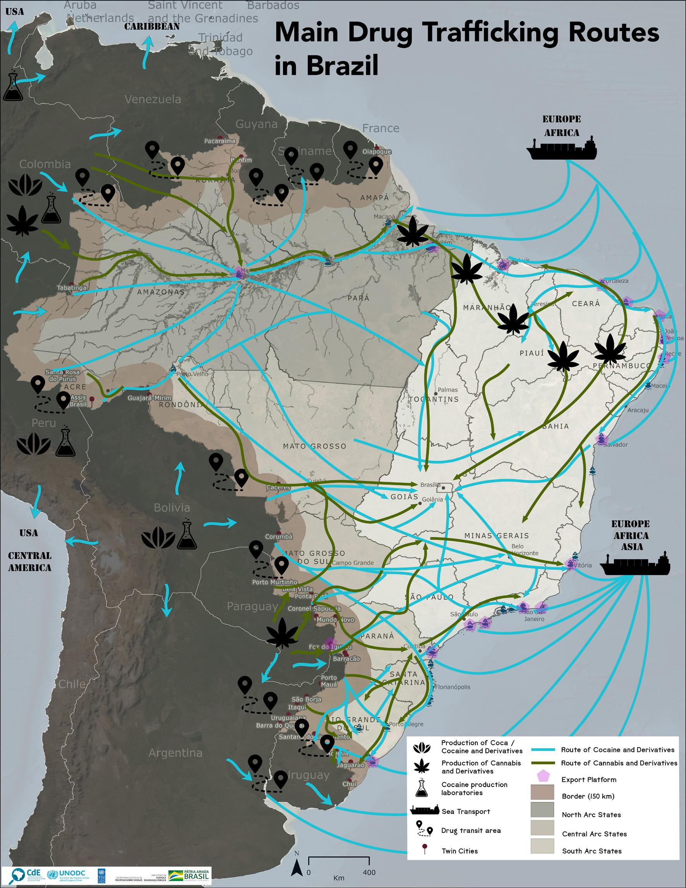{fig-align="center"}

## Forças Armadas e Segurança na Faixa de Fronteira 
    
- Políticas de Defesa
  - Programa Calha Norte (PCN)
  - Sistema de Monitoramento Integrado de Monitoramento de Fronteira (SISFRON)
  - Operação Ágata, Política Nacional de Defesa (PND) e a Estratégia Nacional de Defesa (END)
            
- Políticas de Segurança
  - Estratégia Nacional de Segurança Pública nas Fronteiras (Enafron)
  - Projeto Unidades Especializadas de Fronteiras (Pefron, 2008)
  - Plano Estratégico de Fronteiras (PEF, 2011)
  - Programa de Proteção Integrada de

## Objetivos

O objetivo geral deste estudo é avaliar o impacto das políticas aplicadas na Faixa de Fronteira sobre a segurança pública, com especial atenção à atuação das Forças Armadas.
    
Quanto aos objetivos específicos:

- Analisar os efeitos da descontinuidade geográfica gerada pela Faixa de Fronteira sobre as taxas de homicídio;
- Investigar heterogeneidades nos efeitos da Faixa de Fronteira sobre a violência, considerando diferenças nos fatores socioeconômicos, arcos e períodos.
    
# Revisão de literatura

## Design de Regressão Descontínua
  
Configuração básica de um modelo RD:

- Thistlethwaite e Campbell: impacto de prêmios de mérito escolar no futuro acadêmico dos estudantes. Prêmios eram atribuídos com base em uma determinada nota: estudantes cuja pontuação $X$ atingisse ou excedesse um valor de corte $c$ eram agraciados, enquanto aqueles com pontuação inferior não eram contemplados. Esse mecanismo gera uma \textit{descontinuidade} no tratamento como função da nota. Seja a recepção do tratamento representada por $D \in {0,1}$, temos então $D=1$ se $X\geq c$ e $D=0$ se $X<c$
    
$$
Y = \alpha + D\tau + X\beta + \varepsilon
$$

---

:::: {.columns}

::: {.column width="60%"}
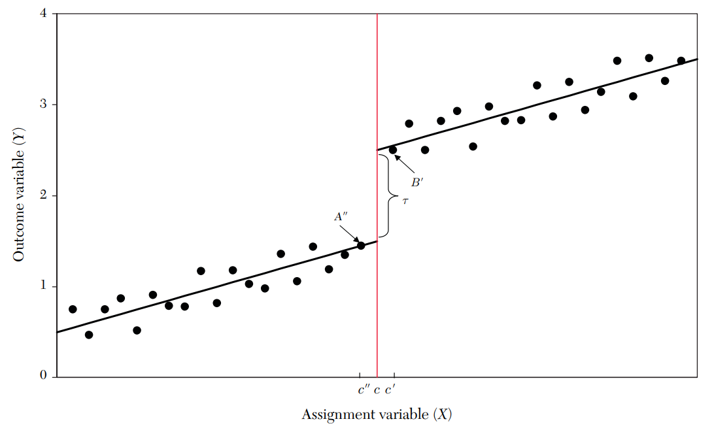
:::

::: {.column width="40%"}
Essa regressão é estimada em uma subamostra dos dados que é estatisticamente otimizada perto do valor do ponto de corte. A razão pela qual todos os dados disponíveis não são utilizados deve-se ao trade-off entre variância e viés

Três elementos importantes para lidar com RD

- Variável de corte (Running variable)
- Ponto de corte (Cutoff)
- Janela, ou largura de banda (Bandwidth)
:::

::::

## Design de Regressão Descontínua Espacial
:::: {.columns}

::: {.column width="60%"}
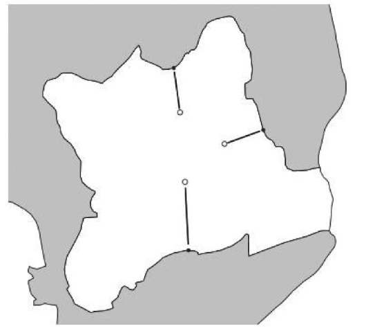
:::

::: {.column width="40%"}
- Uma das principais limitações do RD tradicional em dados espaciais é sua dependência de um ponto de corte unidimensional
- Enquanto o RD tradicional utiliza uma variável contínua para definir o cutoff, em contextos espaciais, a fronteira é bidimensional, frequentemente representada por coordenadas geográficas.
- Isso exige métodos que possam lidar com a natureza multidimensional das fronteiras geográficas.
:::

::::

# Metodologia
## Definição dos grupos
    
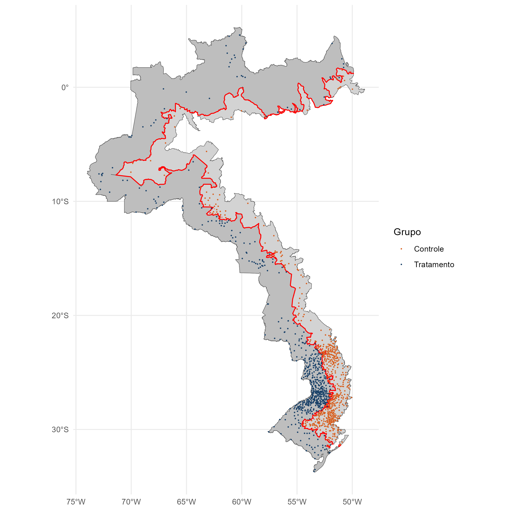{fig-align="center"}

--- 

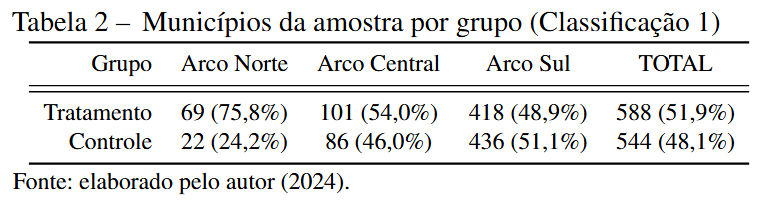{fig-align="center"}

--- 

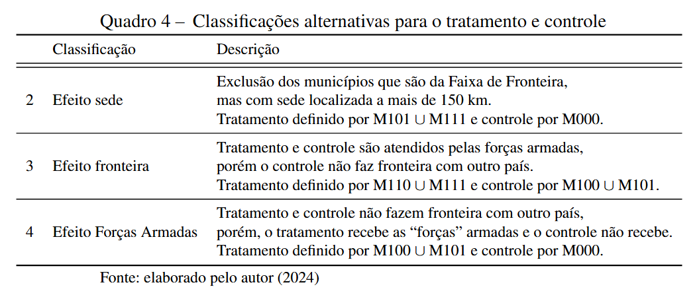{fig-align="center"}

## Base de dados
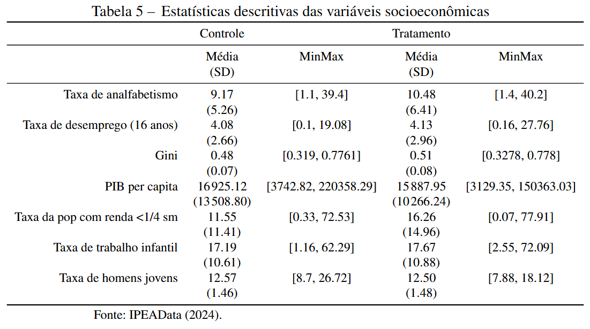{fig-align="center"}

# Resultados

## RD Espacial
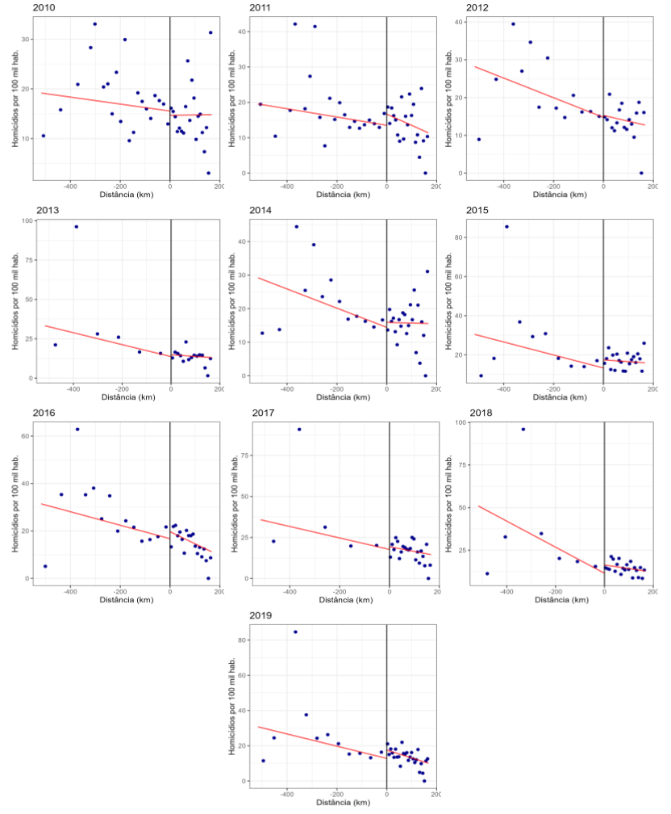{fig-align="center"}

## Modelo RD Espacial II
:::: {.columns}

::: {.column width="60%"}
$$
Y = \alpha + \tau D + \beta X + \gamma Z +\varepsilon
$$
:::

::: {.column width="40%"}
Hipóteses:

- Variável de corte não possa ser manipulada, e, portanto, a participação no tratamento seja exógena \cite{lee_regression_2010}.
- Não haja descontinuidade das covariáveis no ponto de corte \cite{lee_regression_2010}.
- Dados restritos para o mais próximo possível do ponto de corte onde as unidades são mais comparáveis entre si \cite{calonico_optimal_2020}.
:::

::::

## Regressões por arco
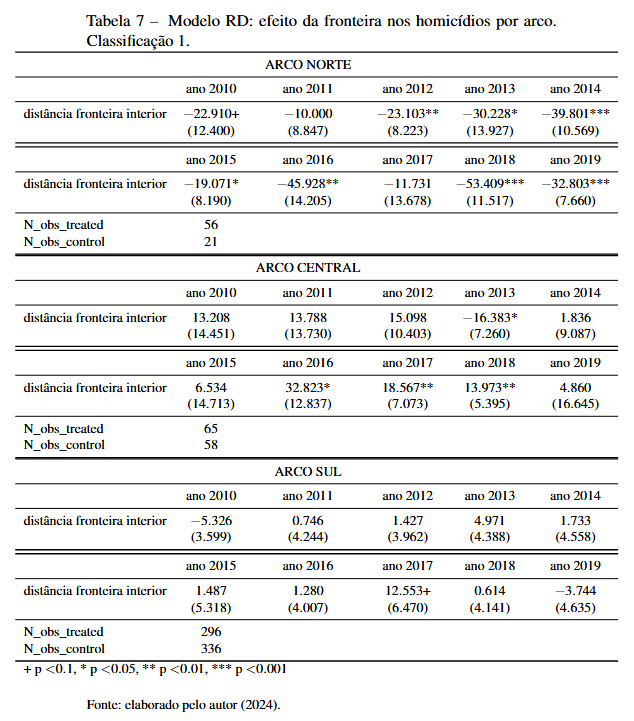{fig-align="center"}

# Considerações Finais

- No Arco Norte, a presença das Forças Armadas na Faixa de Fronteira está
associada a uma redução na taxa de homicídios;

- No Arco Central, por outro lado, foi identificado um efeito contrário
(contraintuitivo);

- No Arco Sul, não foram encontrados efeitos estatisticamente
significativos;

- Conforme apresentado pela literatura, esses efeitos podem estar
relacionados ao tamanho e à intensidade de operações de segurança em
diferentes anos, como a Operação Ágata;

- Dentre as classificações alternativas, o efeito sede e efeito forças
armadas apresentaram padrões semelhantes à análise principal
